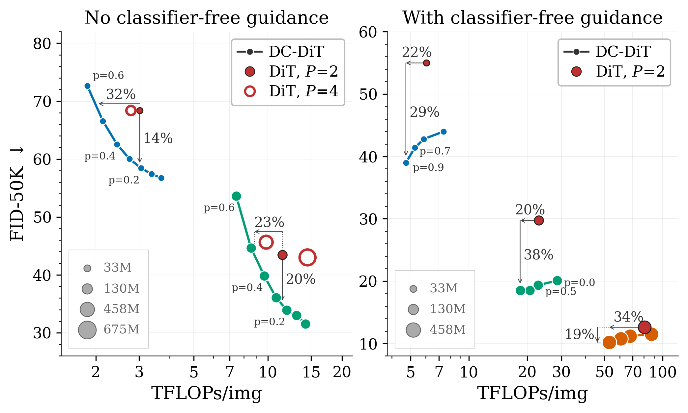
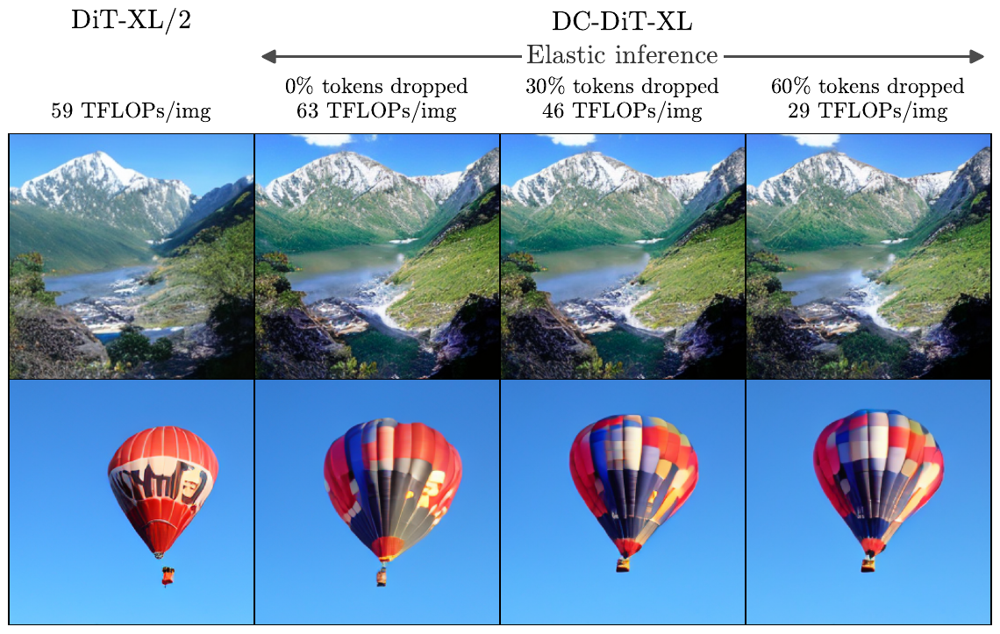
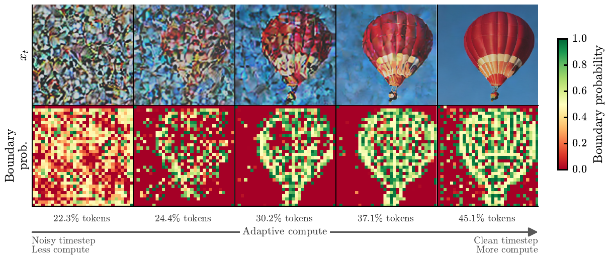

# DC-DiT: Adaptive Compute and Elastic Inference for Visual Generation via Dynamic Chunking

[](https://arxiv.org/abs/2603.06351)

**Akash Haridas, Utkarsh Saxena, Parsa Ashrafi Fashi, Mehdi Rezagholizadeh, Vikram Appia, Emad Barsoum**

---

DC-DiT augments the Diffusion Transformer (DiT) backbone with a learned encoder-router-decoder scaffold that adaptively compresses the 2D input into a shorter token sequence in a data-dependent manner. The chunking mechanism is learned end-to-end with diffusion training and discovers meaningful visual segmentations without explicit supervision: background regions are compressed into fewer tokens and detail-rich regions into more tokens. The mechanism also adapts compression across diffusion timesteps, using fewer tokens at noisy stages and more tokens as fine details emerge.

On class-conditional ImageNet generation, DC-DiT improves the FID-FLOPs Pareto frontier across model scales:



A single checkpoint also supports elastic inference at multiple compute budgets:



The router learns meaningful spatial and temporal compute allocation without supervision, retaining more tokens around object structure, edges, and textures while compressing smooth or predictable regions:



---

## Setup

### Dependencies

- Python 3.10+
- PyTorch 2.0+
- [Accelerate](https://github.com/huggingface/accelerate)
- [timm](https://github.com/huggingface/pytorch-image-models)
- [flash-attn](https://github.com/Dao-AILab/flash-attention)
- [diffusers](https://github.com/huggingface/diffusers) (for VAE)
- [wandb](https://wandb.ai) (for logging)

```bash
pip install torch torchvision accelerate timm flash-attn diffusers wandb
```

## Prepare features before training

To extract ImageNet features with `N` GPUs on one node:

```bash
torchrun --nnodes=1 --nproc_per_node=8 extract_features.py \
    --data-path /path/to/imagenet/train \
    --features-path /path/to/store/features
```

## Training

Training is launched via [Accelerate](https://github.com/huggingface/accelerate) with a YAML config:

```bash
accelerate launch --multi_gpu --num_processes 8 --mixed_precision bf16 train.py --config configs/DCDiT-B-N4.yaml
```

Make sure the `feature_path` in the config (or the default in `config.py`) points to the directory containing extracted features.

## Sampling

### Single-GPU sampling with visualization

```bash
python sample.py --config configs/DCDiT-B-N4.yaml --ckpt /path/to/checkpoint.pt --cfg-scale 4.0
```

This produces `sample.png` and a `chunking_viz.png` showing the router's boundary predictions across diffusion timesteps.

### Multi-GPU sampling for FID evaluation

Generate 50K samples for FID computation:

```bash
torchrun --nnodes=1 --nproc_per_node=8 sample_ddp.py \
    --config configs/DCDiT-B-N4.yaml \
    --ckpt /path/to/checkpoint.pt \
    --output-dir /path/to/samples \
    --cfg-scale 1.0
```

## Evaluation

After generating samples with `sample_ddp.py`, use the standard [OpenAI ADM evaluation suite](https://github.com/openai/guided-diffusion/tree/main/evaluations) to compute FID and Inception Score against the appropriate ImageNet reference batch.

## Elastic Inference and Multi-budget Training

DC-DiT supports elastic inference: a single checkpoint can serve a range of compute budgets at inference time without retraining.

### How it works

DC-DiT's router assigns a boundary-probability score to every spatial token. At inference, `tail_dropping_fraction` discards the *lowest-confidence* boundary tokens, yielding a shorter sequence (higher compression) at the cost of some quality. Without special training this degrades gracefully only if confidence happens to correlate with importance.

Multi-budget training makes this explicit: at each training step a drop fraction `f` is sampled uniformly from a discrete set (default `{0.0, 0.1, 0.2, 0.3}`), the router processes the image with that fraction dropped, and the diffusion loss is backpropagated. This forces the router to push *important* boundaries up the confidence ranking and *unimportant* ones down, so the quality at inference degrades smoothly with increasing tail dropping fraction.

### Elastic inference

Use `--tail-dropping-fraction` with `sample.py` or `sample_ddp.py` on any existing checkpoint to trade quality for FLOPs.

```bash
# Full-quality sampling (default)
python sample.py --config configs/DCDiT-B-N4.yaml --ckpt /path/to/ckpt.pt

# ~1.20× more compression than default (~20% fewer boundary tokens)
python sample.py --config configs/DCDiT-B-N4.yaml --ckpt /path/to/ckpt.pt \
    --tail-dropping-fraction 0.2

# Multi-GPU FID evaluation at reduced budget
torchrun --nnodes=1 --nproc_per_node=8 sample_ddp.py \
    --config configs/DCDiT-B-N4.yaml --ckpt /path/to/ckpt.pt \
    --output-dir /path/to/samples --cfg-scale 1.0 \
    --tail-dropping-fraction 0.2
```

### Lite-CFG

Lite-CFG uses DC-DiT's elastic budget control during classifier-free guidance: the conditional branch keeps a conservative token budget, while the unconditional branch uses a larger tail-dropping fraction. This preserves most class-conditioning compute while reducing the cost of the guidance prediction.

```bash
torchrun --nnodes=1 --nproc_per_node=8 sample_ddp.py \
    --config configs/DCDiT-B-N4.yaml --ckpt /path/to/ckpt.pt \
    --output-dir /path/to/samples --cfg-scale 1.25 \
    --lite-cfg --tail-dropping-fraction 0.0 \
    --uncond-tail-dropping-fraction 0.9
```

## Acknowledgments

This codebase builds on [Fast-DiT](https://github.com/chuanyangjin/fast-DiT), which is an improved PyTorch implementation of [DiT](https://arxiv.org/abs/2212.09748). The high-level structure of the dynamic chunking mechanism code is adapted from [H-Net](https://arxiv.org/abs/2507.07955). We thank the authors for open-sourcing their code.

## License

This project is released under the [Apache License 2.0](LICENSE). Portions of the dynamic chunking code are adapted from H-Net components licensed under MIT, as noted in the source headers.

## Citation

```bibtex
@misc{haridas2026dcditadaptivecomputeelastic,
      title={DC-DiT: Adaptive Compute and Elastic Inference for Visual Generation via Dynamic Chunking}, 
      author={Akash Haridas and Utkarsh Saxena and Parsa Ashrafi Fashi and Mehdi Rezagholizadeh and Vikram Appia and Emad Barsoum},
      year={2026},
      eprint={2603.06351},
      archivePrefix={arXiv},
      primaryClass={cs.CV},
      url={https://arxiv.org/abs/2603.06351}, 
}
```

